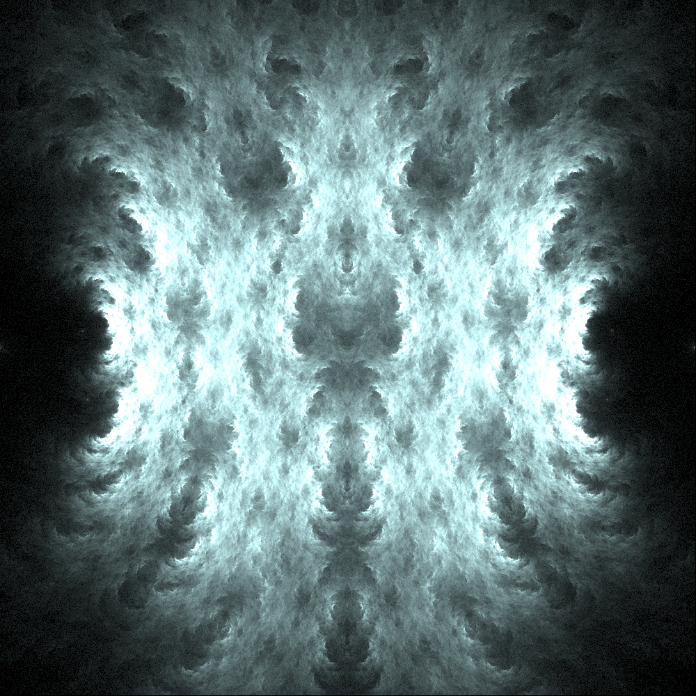
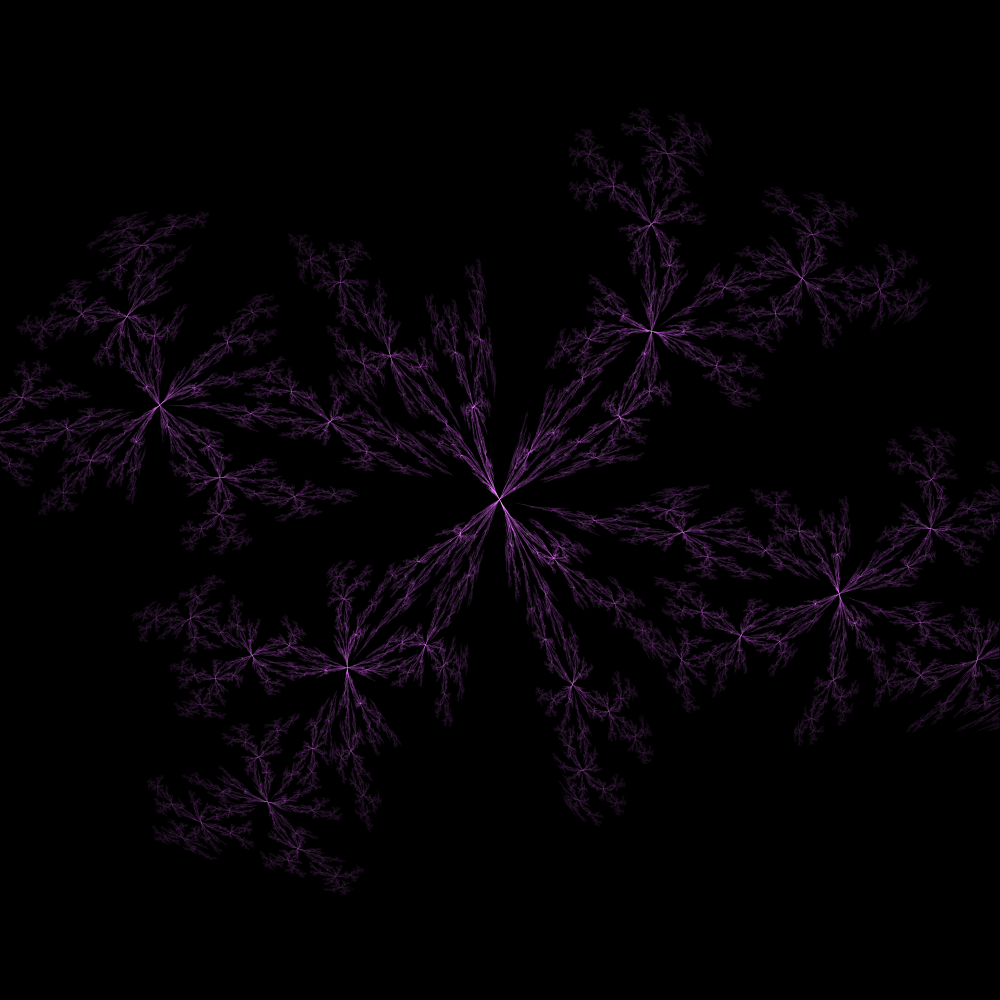
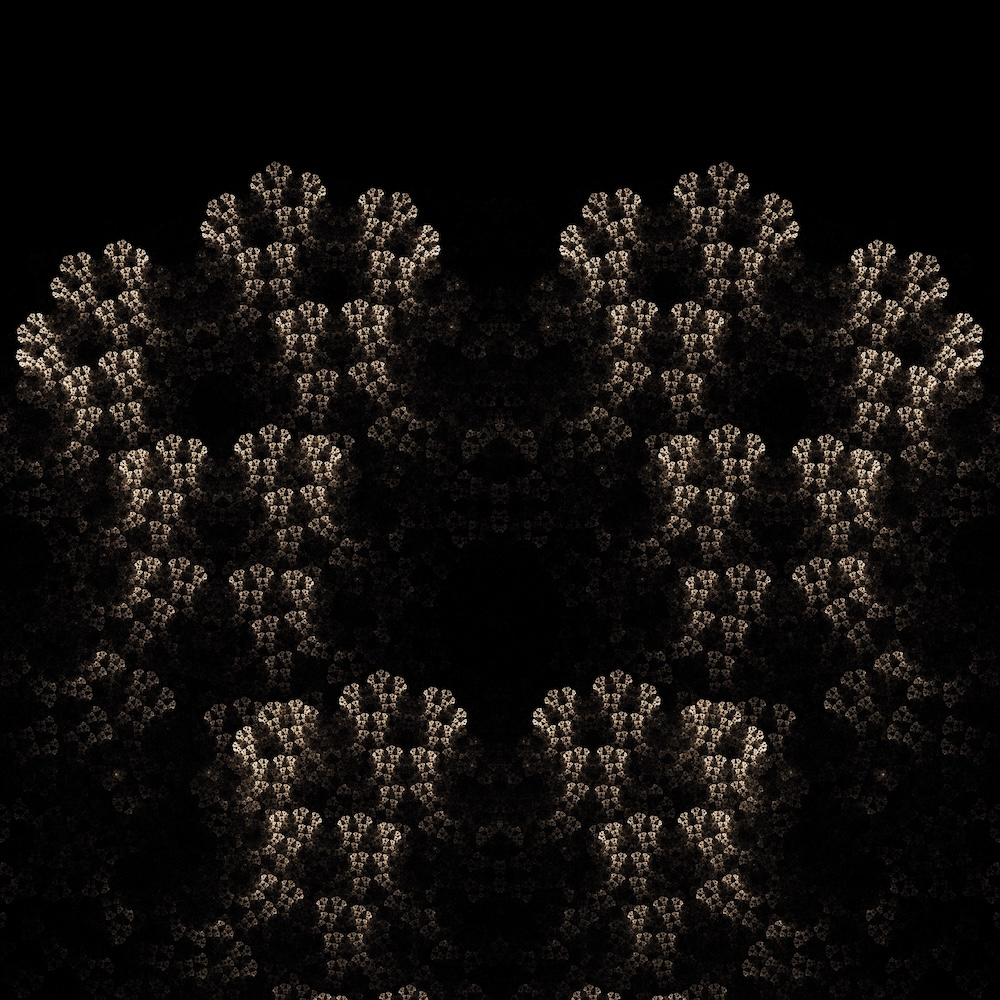

#+TITLE: Iterated Function Systems in Fortran (IFSIF)

This project is an opportunity for me to learn to create and design iterated function systems, as well as Fortran, C++, and interoperability between the two.

* Features
- Additive *or* subtractive color mixing
- Multithreaded rendering
- Post processing with OpenCV
- Several builtin useful functions for generating fractals (see ~functions.f08~)
- Image stacking for noise reduction

* Generating Fractals
All that's needed to compile and run the ifs is make.
#+begin_src bash
  $ make
  $ ./ifs
#+end_src

* Limitations
- The Makefile included was written to use clang on MacOS, but there's no reason it can't be compiled on other platforms. It just will need adjustment.
- At this time, the only way to set the functions is through ~ifs.f08~, but eventually I plan to implement a node editor and API for composing functions together.
  
* Sample images

